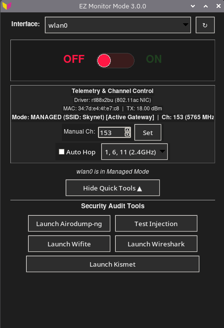

# EZMonitorModeButton

<p align="center">
  
</p>

A simple yet robust Python GUI for the Raspberry Pi to easily enable and disable monitor mode on a wireless interface.

 _________________________
 

In wireless security auditing, the standard way to enable monitor mode is using the  aircrack-ng  suite:

   1.  sudo airmon-ng check kill  (kills network managers,  wpa_supplicant ,  dhcpcd , etc.)
   2.  sudo airmon-ng start wlan0 
    
         While entering monitor mode is easy, exiting it can be tedious and frustrating:

_________________________
The Annoyance:

   
 When  airmon-ng check kill  runs, it completely destroys the system's normal internet connectivity. To get back online, a user has to stop monitor mode and manually restart all networking services in the correct sequence.


_________________________

  
How EZMonitorModeButton solves this: 


   This program automatically stops the monitor interface and sequentially restarts  NetworkManager, wpa_supplicant, avahi-daemon,and dhcpcd .
   
_________________________

  
The Value: 

  
   It acts as a safety net. Instead of leaving the user with broken internet, a single click restores normal network state cleanly.
   
_________________________


    ⋮         ┌────────────────┐
    ⋮         │ Start Auditing │
    ⋮         └────────────────┘
    ⋮                  │
    ⋮                  ▼
    ⋮         ◇───────────────◇
    ⋮         │ Choose Method │
    ⋮         ◇───────────────◇
    ⋮                 │ Command Line                      EZMONITORMODEBUTTON
    ⋮                 ▼
    ⋮         ┌────────────────────────────────┐    ┌──────────────────────┐
    ⋮         │ Type sudo airmon-ng check kill │    │ Click Glow Switch ON │
    ⋮         └────────────────────────────────┘    └──────────────────────┘
    ⋮                          │
    ⋮                          ▼
    ⋮         ┌─────────────────────────────────┐
    ⋮         │ Type sudo airmon-ng start wlan0 │
    ⋮         └─────────────────────────────────┘
    ⋮                          │
    ⋮                          ▼
    ⋮         ┌────────────────────┐
    ⋮         │ Auditing Completed │
    ⋮         └────────────────────┘
    ⋮                    │ Manual Cleanup
    ⋮                    ▼
    ⋮         ┌────────────────────────────────────────────────────────────┐    ┌───────────────────────┐
    ⋮         │ Type stop commands + restart NetworkManager/wpa_supplicant │    │ Click Glow Switch OFF │
    ⋮         └────────────────────────────────────────────────────────────┘    └───────────────────────┘
    ⋮                                                                                       │
    ⋮                                                                                       ▼
    ⋮         ┌─────────────────────────────────┐
    ⋮         │ Internet Restored Automatically │
    ⋮         └─────────────────────────────────┘
    ⋮
    ⋮     


## Version 3.0.1
*   **Documentation:** Added visual application dashboard showcase (`ezmonapp3.png`) displaying real-time telemetry, channel control, and security audit tools.

## Version 3.0.0 (High-Performance Pi & Headless Release!)
*   **70x Faster Network Restoration:** Replaced legacy `systemctl list-unit-files` checks with direct `systemctl cat` unit inspection, slashing network recovery delays from ~5-8 seconds to <0.5s.
*   **Full Headless / SSH CLI Mode:** Operate entirely via terminal without X11 or a desktop display! Supports `ezmonitormode --status`, `ezmonitormode --on [-i iface] [--force]`, `ezmonitormode --off`, `ezmonitormode --channel <ch>`, and `ezmonitormode --test-injection`.
*   **Active Gateway & SSH Session Guard:** Automatically detects which interface carries the default gateway (via `/proc/net/route`) and displays explicit safety warnings before dropping active Internet or SSH connections.
*   **Hardware & Driver Telemetry:** Directly extracts wireless driver name (e.g. `rtl88x2bu`, `brcmfmac`) and USB chipset information from kernel sysfs in sub-millisecond time.
*   **Responsive Small-Screen / Pi Touchscreen Mode:** Auto-detects display height (<=600px) and launches in compact mode (390px) to prevent vertical overflow on Raspberry Pi 7" touchscreens (800x480).
*   **Persistent Injection Test Terminals:** Terminals running `aireplay-ng --test` now pause on completion with "Press Enter to close window...", allowing users to inspect injection percentages and ping ratios before closing.
*   **Modern Terminal Compatibility:** Hardened terminal spawning using universal `bash -c` syntax across `alacritty`, `kitty`, `foot`, `lxterminal`, `xterm`, and Wayland desktop environments.
*   **Channel Hopping Engine Optimization:** Caches active monitor interface and drops idle CPU utilization by >80%.

## Version 2.0.0 (Major Release!)
*   **Packet Injection Testing:** Integrated one-click frame injection test via `aireplay-ng --test <interface>` with live terminal output.
*   **Airodump-ng Quick Launcher:** Direct launcher for live network scanning and BSSID discovery.
*   **Multi-Band Channel Hopping Engine:** Selectable auto-hopping presets including `1, 6, 11 (2.4GHz)`, `All 2.4GHz (1-14)`, `5GHz UNII-1/3 (36-165)`, and `All Channels`.
*   **RFKill Driver Safeguards:** Automatically unblocks wireless interfaces (`rfkill unblock wifi`) during network restoration to prevent hardware soft-blocks on USB dongles.
*   **Broad Terminal Compatibility:** Auto-detects and supports `lxterminal`, `xfce4-terminal`, `mate-terminal`, `konsole`, `terminator`, `tilix`, `alacritty`, `kitty`, `foot`, `xterm`, and `gnome-terminal`.
*   **Hardened Device Parsing:** Unicode-safe decoding and robust `iwconfig` filtering to ignore non-wireless interfaces.


## Installation (Recommended)

### Option 1: Debian Package (Pi/Ubuntu/Debian)

Download the latest `.deb` file from the [Releases](https://github.com/ldl805/EZMonitorModeButton/releases) page and install it using:

```bash
sudo apt update
sudo apt install ./ezmonitormode_3.0.1_all.deb
```

Once installed, you can launch it from your application menu or by running `ezmonitormode` in the terminal.

### Option 2: Via PyPI

```bash
pip install ezmonitormode
```

Once installed, run with `sudo -E ezmonitormode`.

### Option 3: Running from Source

1.  **Clone this repository:**
    ```bash
    git clone https://github.com/ldl805/EZMonitorModeButton.git
    cd EZMonitorModeButton
    ```
2.  **Install dependencies:**
    ```bash
    sudo apt update
    sudo apt install python3-tk aircrack-ng wireless-tools iw
    ```
3.  **Run the application:**
    ```bash
    sudo -E python3 src/ezmonitormode/monitor_gui.py
    ```

## Troubleshooting

### "no display name and no $DISPLAY environment variable"
This occurs if the GUI cannot find your screen.
- **Running via SSH:** Ensure you connected with X11 forwarding: `ssh -X user@pi`.
- **Running via sudo:** Use `sudo -E ezmonitormode` to preserve your display settings.
- **Running in Headless mode:** This application requires a graphical desktop (Pi Desktop, VNC, etc.).

## System Dependencies

Before running `ezmonitormode`, ensure you have the following system tools installed:

```bash
sudo apt update
sudo apt install python3-tk aircrack-ng wireless-tools
```

Optional tools for the shortcut buttons:
```bash
sudo apt install wifite wireshark kismet
```

## License
MIT License
